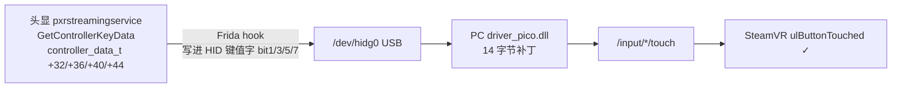

# PICO Neo 3 Pro · DP 直连手柄电容触摸修复

> 用 DP 线串流时，手柄的「电容触摸」在 SteamVR 里失效；这个工具把它修回来。

## 你会遇到的现象

- 手柄的**按键、摇杆、扳机都能用**；
- 但手指只是**轻轻搭在** A/B/X/Y、扳机或摇杆顶上时，SteamVR **毫无反应**；
- 换成无线串流，一切正常。

## 修好之后

A/B/X/Y、扳机、摇杆顶，六处触摸全部正常。

- 头显侧只改内存，**重启失效** ⇒ 每次开机重跑一次；
- 唯一的持久改动是 PC 上一个驱动文件的 **14 字节补丁**，可一键还原。

## 适用条件

| 项       | 要求                                                                    |
| -------- | ----------------------------------------------------------------------- |
| 头显     | **Neo 3 Pro / Pro Eye**（DP 直连只有这系列才有；普通 Neo 3 没有 DP 口） |
| 头显系统 | PUI **5.9.9**（build `202409100313`）                                   |
| PC 软件  | **中国版 v1.2.10** 的 Business Streaming DP                             |
| 连接方式 | **DP 直连**（不是无线串流）                                             |

- 只在 **Neo 3 Pro** 上实测过；**Pro Eye、海外版 Neo 3 Link 未测试**。
- 无线串流本来就正常，**不需要**本项目；V2.x 根本没有 DP 模式。

## 快速开始

### 第 0 步 · 下载本项目

在 GitHub 页面点 **Code → Download ZIP**，下载后解压。下面把解压出的文件夹统称「项目目录」。

PC 上装好 **adb**（Android platform-tools，并加进 PATH）。

### 方式 A · 有 PC（推荐第一次用）

#### 给 PC 驱动打补丁（一次性）

1. **完全退出** SteamVR 和 Business Streaming DP；
2. 以**管理员**打开 PowerShell，进项目目录运行：

   ```powershell
   powershell -ExecutionPolicy Bypass -File src\windows\patch_driver.ps1
   ```

   它会先备份、逐字节校验再写入；只做一次。（装在非默认位置时加 `-Dll <driver_pico.dll 路径>`。）
   只想恢复 A/B/X/Y 的触摸？这一步可以跳过。

#### 头显每次开机：注入头显

1. 在头显 **设置 → 开发者选项** 里**打开 adb**（「USB 调试」或「无线调试」；该设备 adb 免授权，无线无需配对）；
2. 连接头显：**USB 线**直连，或让头显与 PC 连同一网络（PC 开热点最省事）；
3. 打开 PowerShell，进项目目录运行：

   ```powershell
   powershell -ExecutionPolicy Bypass -File src\windows\pico_touch.ps1
   ```

4. 脚本会自动完成：找头显 → 拿临时 root → 推送文件 → 注入。缺的依赖（frida-inject、picohaxx）会从上游自动下载，**需要联网**。
5. 看到 `[✓] 完成` 即可，之后能拔线、关窗口（注入跑在头显本地）。

### 方式 B · 头显装 Termux（以后开机不用 PC）

前置：先按「方式 A」跑通一次，设备端文件就位后再做下面几步。

1. 在头显上装 **Termux**（PC 上 `adb install <termux-arm64.apk>`，或从头显侧载 APK）；
2. 在 PC 上把 Termux 用到的文件放进头显存储：

   ```bash
   adb push src/termux/termux_setup.sh src/termux/termux_touch.sh /sdcard/Download/pico_touch/
   adb push src/windows/picohaxx.neo3.bin /sdcard/Download/pico_touch/picohaxx
   ```

3. 打开 Termux，执行一次：

   ```sh
   termux-setup-storage          # 弹权限框，允许
   cp /sdcard/Download/pico_touch/termux_*.sh ~/
   bash ~/termux_setup.sh
   ```

4. 以后**每次开机**在 Termux 里跑：

   ```sh
   bash ~/termux_touch.sh
   ```

原理与「两步提权」等细节见 [`docs/notes/09-termux.md`](docs/notes/09-termux.md)。

## 确认成功

SteamVR → 设置 → 控制器 → **测试控制器**：手指依次搭在 A/B/X/Y、扳机、摇杆顶上，对应位置出现高亮即为成功。

## 还原 / 卸载

| 改动                      | 怎么还原                                                                   |
| ------------------------- | -------------------------------------------------------------------------- |
| PC 驱动（唯一的持久改动） | 把同目录的 `driver_pico.dll.orig` 复制回 `driver_pico.dll`；或重装 DP 驱动 |
| 头显 root + 注入          | 重启即失效；也可 `picohaxx -unroot`                                        |
| 推送到头显的文件          | 删除 `/data/local/tmp/{picohaxx,frida-inject,hook.js,start_touch.sh}`      |

## 常见问题

- **每次开机都要重跑吗？** 是。root 是临时的（只改内存、不碰系统分区），重启失效。
- **有变砖风险吗？** 头显侧只改内存；PC 侧只改一个驱动文件，且自动备份。
- **注入完能拔线吗？** 能。注入跑在头显本地，与 PC 无关。
- **升级固件后还能用吗？** 不一定，需要重新适配，见 [`docs/notes/06-root.md`](docs/notes/06-root.md)。

## 原理（技术细节，可跳过）

根因：**触摸数据一直都在头显的控制器服务里，只是 DP 链路没人读它。**



- **头显 hook**：把 4 个触摸字段写进 HID 报文（A/B/X/Y 只需这一步，驱动本就支持）。
- **驱动补丁**：把新增的位接到扳机 / 摇杆顶的 `/input/*/touch`。

完整逆向过程、协议与证据见 [`docs/notes/`](docs/notes/)。不可行路线（改 APK / 装 Magisk / 改 `/system`）见 [`docs/notes/08-dead-ends.md`](docs/notes/08-dead-ends.md)。

## 致谢

- [`picohaxx`](https://github.com/264312431/picohaxx) —— Qualcomm Adreno/KGSL 提权，本项目 Neo 3 适配的基础
- **DeepSeek V4.1 Flash**（大肥鱼妈妈！） —— 本项目逆向、调试与文档整理全程使用的模型

## 许可

本仓库代码与文档以 [WTFPL v2](LICENSE)（Do What The Fuck You Want To Public License）发布。其中涉及的第三方组件：

- [`frida`](https://frida.re/) —— 注入框架
- [`picohaxx`](https://github.com/264312431/picohaxx) —— Qualcomm Adreno/KGSL 提权（Neo 3 适配）

各自遵循其原始许可。本项目不分发 PICO 的私有二进制（驱动 DLL、APK 等）。

## 免责声明

本项目涉及**内核提权**与**修改厂商驱动二进制**，仅供研究与个人设备修复使用。请自行评估风险；因使用本工具导致的设备损坏、数据丢失或保修失效，作者不承担责任。
